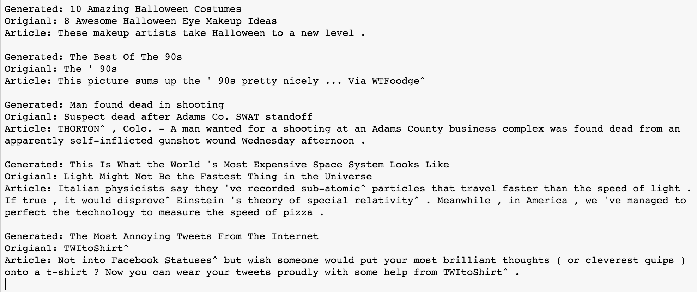

# Automatically generate headlines to short articles

This project attempts to reproduce the results in the paper:
[Generating News Headlines with Recurrent Neural Networks](http://arxiv.org/abs/1512.01712)

## How to run
### Software
* Install [Keras](http://keras.io/)
* `pip install python-Levenshtein`

### Data
It is assumed that you already have training and test data.
The data is made from many examples (I'm using 684K examples),
each example is made from the text
from the start of the article, which I call description (or `desc`),
and the text of the original headline (or `head`).
The texts should be already tokenized and the tokens separated by spaces.

Once you have the data ready save it in a python pickle file as a tuple:
`(heads, descs, keywords)` were `heads` is a list of all the head strings,
`descs` is a list of all the article strings in the same order and length as `heads`.
I ignore the `keywrods` information so you can place `None`.

### Build a vocabulary of words
The [vocabulary-embedding](./vocabulary-embedding.ipynb)
notebook describes how a dictionary is built for the tokens and how
an initial embedding matrix is built from [GloVe](http://nlp.stanford.edu/projects/glove/)

### Train a model
[train](./train.ipynb) notebook describes how a model is trained on the data using [Keras](http://keras.io/)

### Use model to generate new headlines
[predict](./predict.ipynb) generate headlines by the trained model and
showes the attention weights used to pick words from the description.
The text generation includes a feature which was
not described in the original paper, it allows for words that are outside
the training vocabulary to be copied from the description to the generated headline.

## Examples of headlines generated
Good (cherry picking) examples of headlines generated

## Examples of attention weights

